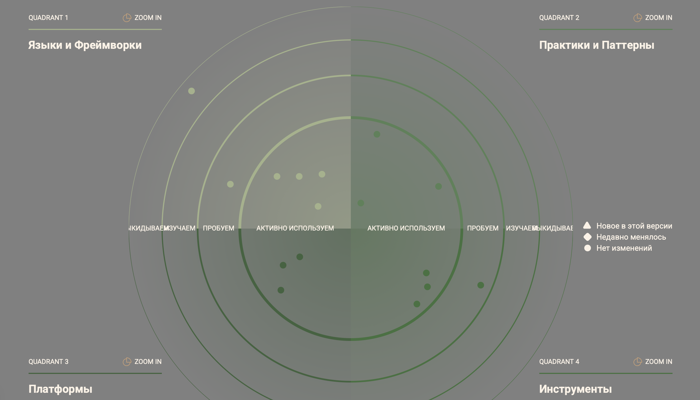
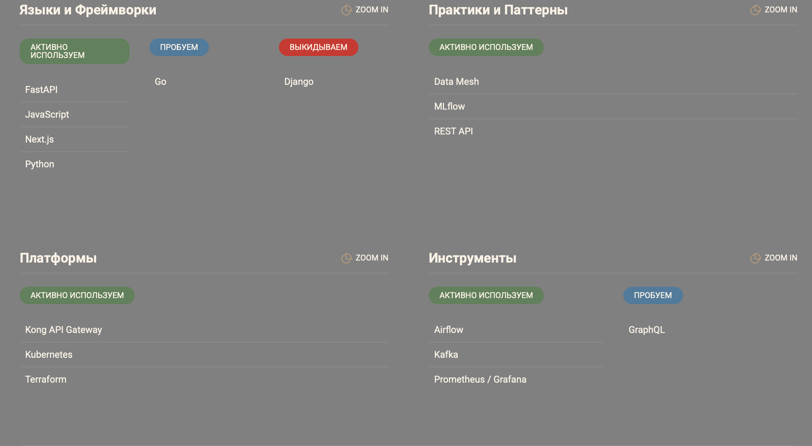

## 1. Techradar

### 1.1 Легенда статусов технологий

| Статус | Обозначение | Описание |
|---|---|---|
| **Сохраняется** | 🔵 KEEP | Используется в текущем состоянии, остаётся в целевой архитектуре |
| **Вводится** | 🟢 ADOPT | Отсутствует сейчас, внедряется в рамках трансформации |
| **Выводится** | 🔴 RETIRE | Используется сейчас, заменяется в ходе трансформации |
| **Оценивается** | 🟡 TRIAL | Рассматривается, пилотируется, решение не принято |

---

### 1.2 Техрадар: текущий и целевой технологический ландшафт

#### Платформа и инфраструктура

| Технология | Статус | Кольцо | Бизнес-сценарий | Обоснование |
|---|---|---|---|---|
| MS SQL Server (legacy) | 🔴 RETIRE | Hold | Текущее хранилище клинических и финансовых данных | Устаревшая версия, вышедшая из поддержки; заменяется современным DWH в рамках этапа 2 |
| PostgreSQL | 🟢 ADOPT | Adopt | Транзакционная БД для доменов Clinic и Fintech | Открытый стандарт, поддерживает независимое развитие доменов |
| Kubernetes | 🟢 ADOPT | Adopt | Оркестрация сервисов всех доменов | Унифицированная среда развёртывания; снижает time-to-market |
| Docker | 🔵 KEEP | Adopt | Контейнеризация сервисов при локальной разработке и CI | Уже применяется в части команд; переносится в единый стандарт |
| CI/CD (GitLab CI / GitHub Actions) | 🟢 ADOPT | Adopt | Автоматизация выпуска и проверки кода во всех доменах | Сокращает цикл поставки; критично для независимости команд |
| IAM / Keycloak | 🟢 ADOPT | Adopt | Централизованная авторизация для порталов и API | Единая точка управления доступом; регуляторное требование |

#### Данные и интеграции

| Технология | Статус | Кольцо | Бизнес-сценарий | Обоснование |
|---|---|---|---|---|
| Apache Kafka | 🟢 ADOPT | Adopt | Асинхронный обмен событиями между доменами (Clinic → DWH → AI) | Развязывает домены; исключает прямые зависимости между системами |
| Data Mesh / Domain ownership | 🟢 ADOPT | Trial | Независимое управление данными в доменах Clinic, Fintech, AI | Архитектурный паттерн целевого состояния; команды владеют своими данными |
| Apache Airflow | 🟢 ADOPT | Adopt | Оркестрация ETL/ELT пайплайнов и batch-обучения моделей | Управление зависимостями задач; мониторинг качества данных |
| ClickHouse / DWH (целевой) | 🟢 ADOPT | Adopt | Аналитическое хранилище для витрин данных и отчётности | Заменяет MS SQL DWH; многократно ускоряет построение отчётов |
| dbt (data build tool) | 🟢 ADOPT | Trial | Трансформация и документирование данных в DWH | Контроль качества, lineage, версионирование моделей данных |
| API Gateway | 🟢 ADOPT | Adopt | Единая точка интеграции с внешними партнёрами (Фарма, Устройства) | Стандартизирует партнёрские интеграции; упрощает масштабирование |
| FTP / файловый обмен (legacy) | 🔴 RETIRE | Hold | Текущая интеграция с партнёрами через файлы и выгрузки | Не масштабируется; заменяется API Gateway и Kafka в этапе 5 |

#### AI и аналитика

| Технология | Статус | Кольцо | Бизнес-сценарий | Обоснование |
|---|---|---|---|---|
| MLflow | 🟢 ADOPT | Adopt | Управление экспериментами и версиями моделей (Model Registry) | Обеспечивает воспроизводимость; критично для медицинских моделей |
| Vertex AI (Google Cloud) | 🟡 TRIAL | Trial | Масштабируемое обучение ML-моделей на GPU | Оценивается как альтернатива on-premise GPU; решение принимается в этапе 4 |
| Jupyter Notebooks | 🔵 KEEP | Adopt | Исследовательская аналитика и прототипирование моделей | Остаётся инструментом Data Science; не выходит в продакшн |
| Excel / BI-отчёты вручную | 🔴 RETIRE | Hold | Текущая управленческая отчётность | Медленно, ненадёжно; заменяется витринами данных и дашбордами в этапе 3 |
| Apache Superset / Grafana (аналитика) | 🟢 ADOPT | Adopt | Self-service аналитика для бизнес-пользователей; портал данных | Ключевой артефакт целевой архитектуры — витрина самообслуживания |

#### Наблюдаемость и качество

| Технология | Статус | Кольцо | Бизнес-сценарий | Обоснование |
|---|---|---|---|---|
| OpenTelemetry | 🟢 ADOPT | Adopt | Трассировка запросов и метрики между всеми доменами | Единый стандарт наблюдаемости; независим от вендора |
| Prometheus + Grafana | 🟢 ADOPT | Adopt | Мониторинг SLA, алертинг, дашборды стабильности | Контроль доступности медицинских и финтех-сервисов |
| Great Expectations / dbt tests | 🟢 ADOPT | Trial | Автоматический контроль качества данных на всех слоях DWH | Закрывает текущий пробел: отсутствие DQ-контроля в системе |
| Ручное тестирование данных | 🔴 RETIRE | Hold | Текущая проверка качества данных в отчётах | Постфактум; не масштабируется; заменяется автоматическим DQ |

---

## 2. Roadmap

| Этап | Период | Основные действия | Результат | Ответственные | Ресурсы |
|---|---|---|---|---|---|
| **1. Инфраструктурное основание** | Q1–Q2 2025 | Внедрение Kubernetes, CI/CD, централизованной авторизации (IAM) | Унифицированная среда для сервисов | DevOps Team | Облако, лицензии CI/CD |
| **2. Доменное разделение и Data Platform** | Q2–Q3 2025 | Реализация Data Mesh, Kafka, выделение доменов Clinic, Fintech, AI; замена MS SQL DWH на целевое хранилище (ClickHouse) | Независимое развитие направлений; устранение legacy DWH и рисков безопасности | Архитектурная команда | Kafka, ClickHouse, DataOps |
| **3. Портал самообслуживания** | Q3–Q4 2025 | Запуск витрин данных (Data Marts), подключение Apache Superset/Grafana, настройка контроля качества данных (dbt, Great Expectations), вывод Excel-отчётности | Бизнес-пользователи самостоятельно получают аналитику; автоматический контроль качества данных | Data Platform Team | Apache Superset, dbt, Grafana |
| **4. AI-интеграции и аналитика** | Q4 2025 | Внедрение MLflow и Airflow, подключение AI к медицинским данным, пилот Vertex AI | Прогнозы и диагностика в реальном времени | Data Science + AI | GPU, Vertex AI |
| **5. Масштабирование и внешние партнёры** | Q1 2026 | Интеграция Pharma и Устройств через API Gateway; вывод из эксплуатации файлового обмена (FTP) | Расширение экосистемы; стандартизированные партнёрские интеграции | Partner Integration Team | API Gateway, SDK |
| **6. Мониторинг и контроль качества** | Q1–Q2 2026 | Настройка OpenTelemetry, SLA-дашборды, финальная автоматизация DQ на всех слоях | Стабильность медицинских и финтех-сервисов; прозрачный контроль | SRE Team | Grafana, Prometheus, OpenTelemetry |

---

## 3. Обоснование изменений

| Этап | Цель | Влияние на бизнес |
|---|---|---|
| **Инфраструктурное основание** | Ускорить выпуск сервисов | Сокращение time-to-market, стабильная среда |
| **Доменное разделение и Data Platform** | Уменьшить зависимость от DWH и централизованных команд; вывести legacy MS SQL | Рост автономности и скорости разработки; устранение рисков безопасности |
| **Портал самообслуживания** | Повысить удобство клиентов и партнёров; реализовать ключевой артефакт целевой архитектуры | Снижение затрат на поддержку, рост удовлетворённости, self-service аналитика |
| **AI-интеграции** | Улучшить диагностику и прогнозирование | Повышение точности решений и снижение ошибок |
| **Масштабирование и партнёры** | Открыть новые источники дохода | Расширение экосистемы, интеграция внешних API |
| **Мониторинг и качество** | Снизить операционные риски | Прозрачность, контроль SLA, повышение доверия |
